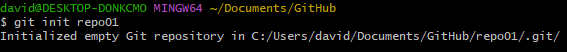
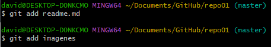
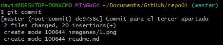
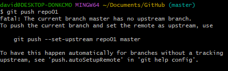
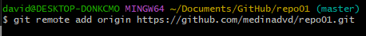
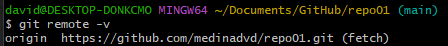
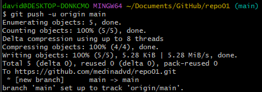
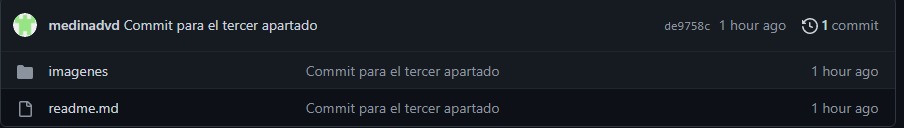

# Git & Markdown

## Ejercicio 1

***

### **1.1**

Una vez creado el directorio en local, lo inicilizamos en el Git mediante el
comando: "git init repo01".
Verificamos que la operación ha sido satisfactoria con el mensaje que la
consola nos devuelve.

### **1.2**

El segundo apartado consiste en la creación de este mismo fichero, por lo
tanto pasamos al siguiente.

### **1.3**

Dentro del directorio "repo01" en la consola ejecutamos el comando:
"git add", lo utilizamos para añadir al staging area el fichero "readme.md" y
la carpeta que contiene las imagenes utilizadas en este archivo.

Hacemos un snapshot del contenido que hemos añadido anteriormente mediante el
siguiente comando: git commit.

El lifecycle status actual del fichero sería unmodified.

### **1.4**

Una vez realizado el comando "git push repo01" nos devuelve un mensaje de
error, ya que no hemos creado el fichero remoto.

### **1.5**

Como hemos visto en el apartado anterior, si ejecutamos el comando
"git remote -v" no sucede nada porque no hemos creado el directorio remoto.

### **1.6**

Asociamos el repositorio remoto que hemos creado en GitHub mediante el siguiente
comando: git remote add origin "URl del directorio remoto"

### **1.7**

Una vez ejecutado nuevamente el comando "git remote -v" se muestra el estado del fichero remoto.

### **1.8**

Volvemos a realizar la subida de los ficheros.

### **1.9**

Desde GitHub accedemos al directorio y podemos apreciar que muestra la fecha en la que se realizó el commit y los ficheros se mantenienen en el mismo estado
que cuando se realizó.

